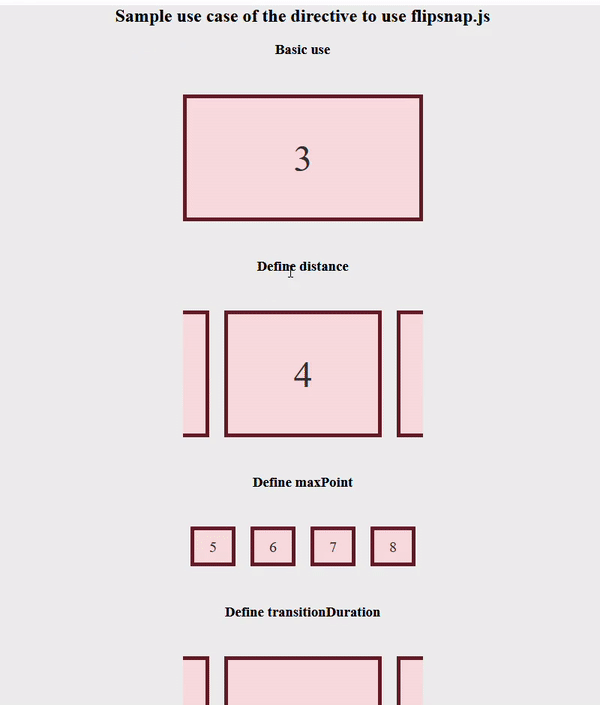

# AngularDirectiveFlipsnap

This is an Angular directive to use flipsnap.js library. It interfaces with the library to provide UI of snap and slide.
flipsnap.js is a JavaScript library. (http://hokaccha.github.io/js-flipsnap/)<br/><br/>



## Technology stack

This repository is built on top of Angular however in the implementation detail, we will find other supporting technologies as well.

- [Flipsnap.js] - flipsnap.js is a JavaScript library that provides UI of snap and slide.
- [Angular] - A JavaScript framework for building user interfaces]

## Parts

### FlipsnapDirective
This is the Angular directive that provides UI of snap and slide.

### TestPageComponent
On this page sample use cases of flipsnap directive are added.

## Usage
The basic use case is given below. Details use case is given on the test page.

```sh
  <div appFsnap [options]="flipSnapOptions" class="contents">
    <div class="content">The content to flip and snap</div>
  </div>
```
appFsnap: The directive selector<br/>
options: Options for the flip and snap process

### Options

- maxPoint: 
    This is the stop point count. The default value is auto-calculated from the element item count. 
- distance: 
    This is the move distance. The default value is auto calculated from element width and maxPont. 
- transitionDuration: 
    This is the transition duration (millisecond). The default value is 350. 
- disableTouch: 
    When set true, the touch event is disabled. Only handling button or etc interface. default is false.
- disable3d: 
    When supporting 3D transform browser and this option is set to true, it is not used 3D transform and uses 2D transform. 
- threshold: 
    This is the pixel count of the touch move after which the slide starts.

## Development server

Run `ng serve` for a dev server. Navigate to `http://localhost:4200/`. The app will automatically reload if you change any of the source files.

## Build

Run `ng build` to build the project. The build artifacts will be stored in the `dist/` directory. Use the `--prod` flag for a production build.

## Running unit tests

Run `ng test` to execute the unit tests via [Karma](https://karma-runner.github.io).

## License

This project is [MIT licensed](https://github.com/Saeed1989/Angular-directive-for-flipsnap-operation/blob/main/LICENSE)

[Angular]: https://angular.io/
[Flipsnap.js]: http://hokaccha.github.io/js-flipsnap/